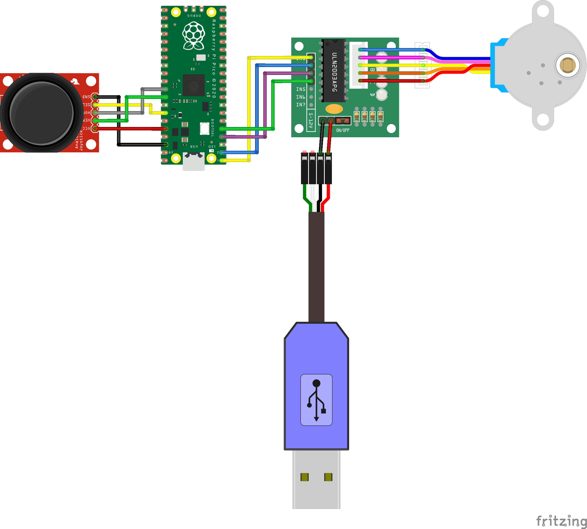

# Control a stepper motor with a Raspberry Pi Pico

Welcome to the "Control a stepper motor with a Raspberry Pi Pico" 
repository!

You can find the full tutorial [here](https://diy-home.org/control-a-stepper-motor-with-a-raspberry-pi-pico/)
- how to build your device
- code explanation
- how to setup your Raspberry Pi Pico

